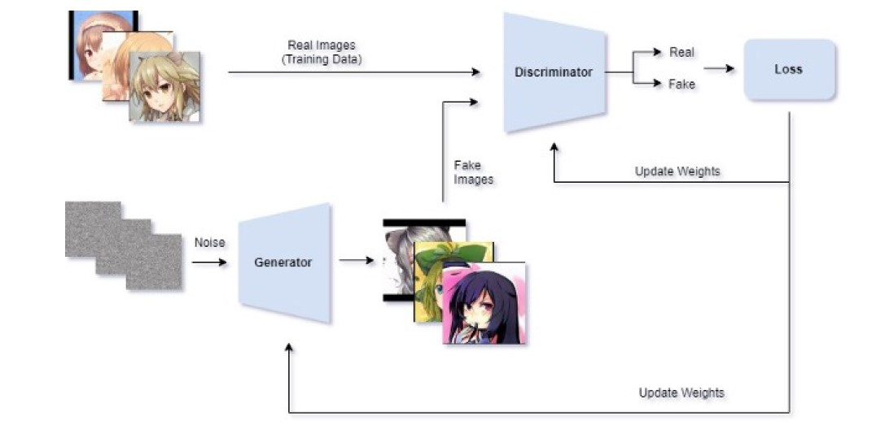

# gan

Realisé par 
- Nihal OUHAOUADA 
- Pierre LACLAVERIE
- Thibaud SIMON
- Yann REYNAUD 

[Sujet](PROJET%20-%20GAN%20-%20OUHAOUADA_LACLAVERIE_SIMON_REYNAUD.pdf)
# Introduction 
Quand un dataset n'a pas assez de données pour entrainer un modèle, il est possible d'entrainer un GAN, deux réseaux de neurones qui travaillent en concurrence pour génerer des images. D'un cotés le générateur qui va générer des images et le discriminateur qui va déterminer si l'image est une image réelle ou non. L'objectif est que le discriminateur se trompe 50 % du temps.

# Dataset

Nous avons choisi de prendre le dataset [anime faces](https://www.kaggle.com/datasets/soumikrakshit/anime-faces) pour notre projet. Celui-ci comporte plus de 21 000 images tirées du site [getchu.com](http://www.getchu.com/). L’algorithme utilisé est tiré de ce [github](https://github.com/nagadomi/lbpcascade_animeface), il permet de localiser toutes les faces (têtes) de personnages tirés d’animé. (auteur: Soumik Rakshit, publication kaggle il y a 3 ans)

# Méthodologie

Pour réaliser ce GAN, nous avons créé un discriminateur et un générateur. Ces deux vont s'entrainer en étant en concurrence l'un avec l'autre.

[Source](https://towardsdatascience.com/generating-anime-characters-with-stylegan2-6f8ae59e237b)

Le générateur va prendre un vecteur de bruit en entrée et va générer une image à partir de celui-ci.

Les premières images issues du générateur ressemblent à cela : 

Voici un résumé de la manière de la méthode.

Au cours de l'entrainement, les images générées commencent à ressembler à des visages.

Au cours des premières epochs, on voit se dessiner les premières formes de visages.

Epoch 5 : 

Epoch 50: 

Epoch 150 : 

On voit que le résultat est assez joli, cependant la forme du visage, la couleur de certains yeux ou encore la forme de la bouche ne sont pas très réalistes.

# Résultats 

Au bout de 150 epochs, nous avons choisit de sauvegarder le modèle pour pouvoir l'utiliser sans avoir à passer par l'entrainement. 

